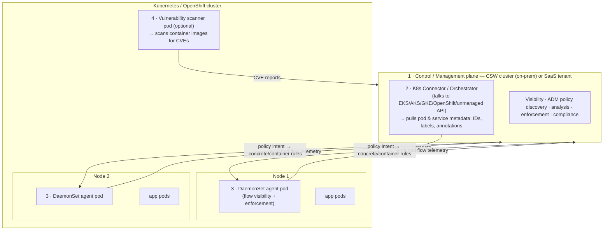

# Cisco Secure Workload on Kubernetes & OpenShift


**Install the Secure Workload agent on Kubernetes / OpenShift nodes, and
understand exactly how it sees flows and enforces policy inside a cluster.**

This repo has two halves:

1. **How it works** ([`docs/`](./docs/)) — a practitioner's deep-dive into the
   CSW Kubernetes architecture: the four components, how flows are captured and
   reported for every traffic pattern (pod-to-pod, via service, external, egress),
   how a policy *intent* is translated into concrete **node** rules and
   **container** (pod) rules, scope design, and container vulnerability scanning.
2. **How to install** ([`install/`](./install/)) — the Cisco-documented Agent
   Script Installer path for the DaemonSet, plus prerequisites, the Kubernetes
   connector, OpenShift specifics (SCC), verification, and uninstall.

> **Primary Cisco sources.** This guide is built from Cisco's
> [Secure Workload and Kubernetes Security — Deep Dive](https://secure.cisco.com/secure-workload/docs/secure-workload-and-k8s)
> whitepaper and the
> [Install Kubernetes or OpenShift Agents (4.0 User Guide)](https://www.cisco.com/c/en/us/td/docs/security/workload_security/secure_workload/user-guide/4_0/cisco-secure-workload-user-guide-on-prem-v40/deploy-software-agents.html).
> See [`docs/00-official-references.md`](./docs/00-official-references.md).

> **About the diagrams.** This guide embeds the **official Cisco figures**
> from the whitepaper (in [`assets/figures/`](./assets/figures/), numbered
> `figure-01.png` … `figure-46.png`) alongside **text-based Mermaid / ASCII
> summaries** that annotate the same concepts for quick scanning and diffing.
> The figures are © Cisco Systems, Inc., reproduced from the
> [Secure Workload and Kubernetes Security — Deep Dive](https://secure.cisco.com/secure-workload/docs/secure-workload-and-k8s)
> whitepaper for reference — see [`assets/figures/NOTICE.md`](./assets/figures/NOTICE.md).

---

## Executive overview — 60-second read

- **What it is.** Secure Workload brings **zero-trust microsegmentation** to
  Kubernetes/OpenShift the same way it does to VMs and bare metal — with full
  east-west flow visibility, automatic policy discovery, and host-firewall
  enforcement — **without a per-pod sidecar**.
- **How it sees the cluster.** A **DaemonSet** runs one privileged agent pod per
  node. It captures flows at **both** the pod and node network interfaces, then
  the platform **enriches every flow with Kubernetes metadata** (pod, namespace,
  labels, service) pulled by a management-plane **connector**.
- **How it enforces.** A policy *intent* (e.g. "payment → user-db on tcp/27017")
  is compiled by the policy engine into **container rules** in the pod's iptables
  namespace and, where needed, **concrete rules** in the node's iptables — while
  **CNI rules are preserved**.
- **What it adds on top.** Optional **container image vulnerability scanning**
  (CVEs), and CVE-/label-based segmentation policies.
- **Where to start.** New to the K8s architecture →
  [`docs/01-architecture.md`](./docs/01-architecture.md). Ready to deploy →
  [`install/03-agent-script-installer.md`](./install/03-agent-script-installer.md).
- **Disclaimer.** Community practitioner guide; not an official Cisco
  publication. Always validate against your CSW release and the
  [Compatibility Matrix](https://www.cisco.com/c/en/us/td/docs/security/workload_security/secure_workload/user-guide/4_0/cisco-secure-workload-user-guide-on-prem-v40/deploy-software-agents.html).

---

## The four components



| # | Component | Where it runs | Job |
|---|---|---|---|
| 1 | **Control / management plane** | CSW cluster (on-prem) or SaaS tenant | Processes telemetry; defines, validates, monitors policy |
| 2 | **Connector / orchestrator** | Management plane | Talks to the cluster's K8s API to pull pod/service **metadata** (IDs, labels, annotations) |
| 3 | **DaemonSet agent** | One pod per node | **Flow visibility** (conversation or detailed mode) + **policy enforcement** (node + pod iptables) |
| 4 | **Vulnerability scanner** | One pod (optional) | Scans Linux container images for **CVEs** |

*(Recreation of whitepaper Figure 1 — Solution Overview, and Figure 2 — Architecture.)*

---

## The Kubernetes microsegmentation lifecycle

```
 Scope design  →  Policy discovery  →  Analyze / validate  →  Enforce on nodes  →  Monitor compliance
 (single/split)   (ADM or manual)     (live, no enforce)     (node + pod rules)    (live analysis)
      │                 │                     │                      │                    │
 docs/04          docs/03 + ADM         analysis (live)        docs/03-enforcement    operations
```

| Step | What you do | Read |
|---|---|---|
| 1 · Scope design | Group cluster(s) into one scope, or split per namespace/app | [`docs/04-scope-design.md`](./docs/04-scope-design.md) |
| 2 · Policy discovery | Auto-discover via ADM, or author manually / IaC | [`docs/03-enforcement-translation.md`](./docs/03-enforcement-translation.md) |
| 3 · Analyze & validate | Live-analyze policy vs real cluster traffic (no enforcement) | [`docs/02-flow-visibility.md`](./docs/02-flow-visibility.md) |
| 4 · Enforce | Policy engine compiles intent → node + pod iptables | [`docs/03-enforcement-translation.md`](./docs/03-enforcement-translation.md) |
| 5 · Monitor | Continuous compliance via live analysis | [`operations/02-troubleshooting.md`](./operations/02-troubleshooting.md) |

---

## Repo map

| Area | Folder | Start here |
|---|---|---|
| **How it works** | [`docs/`](./docs/) | [`docs/01-architecture.md`](./docs/01-architecture.md) |
| **How to install** | [`install/`](./install/) | [`install/03-agent-script-installer.md`](./install/03-agent-script-installer.md) |
| **Day-2 operations** | [`operations/`](./operations/) | [`operations/03-faq.md`](./operations/03-faq.md) |
| **Jump by question** | — | [`INDEX.md`](./INDEX.md) |

---

## Related repos

- **[CSW-Agent-Installation-Guide](https://github.com/chandrapati/CSW-Agent-Installation-Guide)**
  — agent install across **all** platforms (Linux, Windows, cloud, agentless,
  and its own `kubernetes/` install methods incl. Helm/GitOps community patterns).
  This repo goes deeper on the **K8s data-path and enforcement model**.
- **[CSW-Policy-Lifecycle](https://github.com/chandrapati/CSW-Policy-Lifecycle)**
  — discovery → analysis → enforcement → operations for policy in general.

---

> **Disclaimer.** Independent practitioner documentation. Cisco, Secure
> Workload, and Tetration are trademarks of Cisco Systems, Inc. Always confirm
> behavior against the official documentation in
> [`docs/00-official-references.md`](./docs/00-official-references.md) and your
> licensed CSW release.
