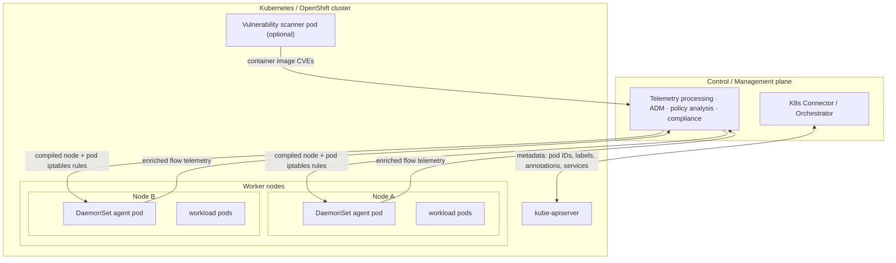

# Architecture — the four components

> **Cisco source.** [Secure Workload and Kubernetes Security — Deep Dive](https://secure.cisco.com/secure-workload/docs/secure-workload-and-k8s)
> (Figures 1–2).

Secure Workload delivers zero-trust microsegmentation and workload security
across a hybrid multicloud estate through **agent-based and agentless**
approaches. On Kubernetes/OpenShift it gives you:

- **Full visibility** — contextualized network communications, vulnerable
  packages (CVEs), and runtime process/forensic activity (MITRE TTPs).
- **Automatic policy discovery & analysis** — achieve zero-trust segmentation,
  and analyze policy **without enforcing** it first.
- **Enforcement & compliance monitoring** — at host firewalls (Linux iptables /
  Windows Firewall on bare metal, VMs, **K8s/OpenShift nodes**, or DPUs), cloud
  built-in controls (AWS SG, Azure NSG, GCP firewall), and network devices.

---

## The four components



*(Recreation of Figure 2 — Architecture.)*

### 1. Control / management plane
On-prem Secure Workload cluster **or** SaaS-hosted tenant. This is where
workload telemetry is processed and where policies are **defined, validated, and
monitored**.

### 2. Secure Workload connector / orchestrator
Created **on the management plane**. It talks to the cluster's Kubernetes API
(EKS / AKS / GKE / OpenShift / unmanaged Kubernetes) to gather **metadata about
pods and services** — pod IDs, annotations, labels/tags, service definitions.
This metadata is what turns raw IP flows into label-aware, dynamic policy
objects.

> **Visibility vs. metadata.** The connector provides *metadata*; the DaemonSet
> provides *flow telemetry and enforcement*. You generally want **both** — the
> connector alone gives inventory context but not flows or enforcement.

### 3. Kubernetes DaemonSet (the agent)
A **DaemonSet** guarantees the Secure Workload agent pod runs on **every** node,
at all times. Two functions:

- **Flow visibility** — monitors network flows on the node and reports them. Two
  modes:
  - **Conversation mode** — the agent **summarizes** flow observations and
    reports them every **15 seconds**.
  - **Detailed mode** — the agent captures **every packet** on the node
    (node namespace *and* pod namespaces) and reports every **1 second**.
- **Policy enforcement** — programs firewall rules on each node to restrict
  lateral movement among pods, nodes, and across the cluster boundary.

### 4. Vulnerability scanner (optional)
If you enable vulnerability scanning, a **scanner pod** is spun up on the
cluster. It inspects every **Linux** container image running on the cluster and
reports the associated **CVEs** to the management plane. See
[`docs/05-vulnerability-scanning.md`](./05-vulnerability-scanning.md).

---

## Where capture happens — node, not sidecar

```
        ┌────────────────────────── Node ──────────────────────────┐
        │                                                           │
        │   ┌─────────┐      ┌─────────┐         ┌───────────────┐  │
        │   │  pod A  │      │  pod B  │          │ DaemonSet      │ │
        │   │  veth ──┼──┐ ┌─┼── veth  │          │ agent pod      │ │
        │   └─────────┘  │ │ └─────────┘          │ (hostNetwork,  │ │
        │                │ │                      │  hostPID,      │ │
        │      pod netns │ │  pod netns           │  privileged)   │ │
        │                ▼ ▼                      └───────┬───────┘  │
        │        ┌──────────────────┐                    │          │
        │        │  node netns      │  ← node interface  │ captures │
        │        │  (host iptables) │ ───────────────────┘ at BOTH  │
        │        └──────────────────┘    pod + node interfaces      │
        └───────────────────────────────────────────────────────────┘
```

The agent captures flows at **two levels — the pod network interfaces and the
node network interfaces**. This dual capture is *why* CSW can reconstruct what a
flow looked like before and after NAT/DNAT, and why some communication patterns
produce more than one flow record (see
[`docs/02-flow-visibility.md`](./02-flow-visibility.md)).

> **No per-pod sidecar.** Unlike a service-mesh model, CSW does not inject a
> proxy container into each workload pod. One privileged agent per node sees
> everything that traverses that node's kernel and pod veths.

---

## See also

- [`docs/02-flow-visibility.md`](./02-flow-visibility.md) — exactly which flows
  get logged for each communication pattern
- [`docs/03-enforcement-translation.md`](./03-enforcement-translation.md) — how a
  policy intent becomes node + pod rules
- [`docs/04-scope-design.md`](./04-scope-design.md) — single vs split scope
- [`install/02-connector-orchestrator.md`](../install/02-connector-orchestrator.md)
  — set up component #2
- [`install/03-agent-script-installer.md`](../install/03-agent-script-installer.md)
  — deploy component #3
