# Flow visibility — what gets logged for each traffic pattern

> **Cisco source.** [Secure Workload and Kubernetes Security — Deep Dive](https://secure.cisco.com/secure-workload/docs/secure-workload-and-k8s),
> Use Case #1 (Figures 3–20).

This is the single most useful thing to understand about CSW on Kubernetes:
**a single logical connection can produce one, two, or three flow records**
depending on whether it crosses nodes, goes through a Service (DNAT), and what
CNI mode is in use. If you don't know this, the flow map looks confusing. Once
you do, it reads perfectly.

The agent captures at **two levels**: the **pod** network interface and the
**node** network interface (Figure 6). The platform then **dedupes** or marks
flows as **Related** as appropriate.

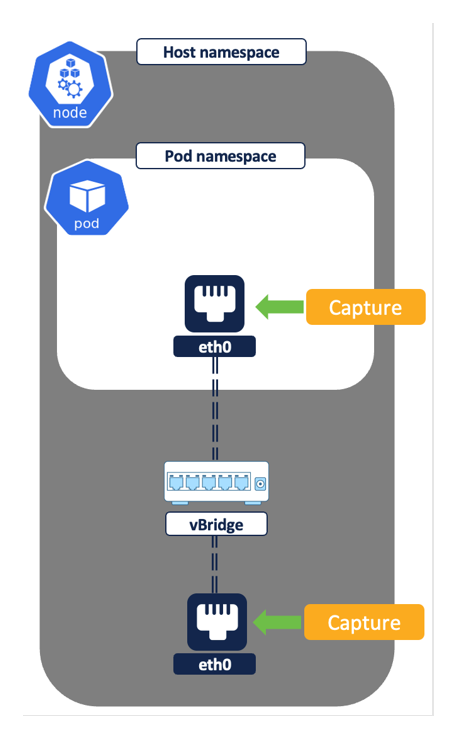
*Figure 6 — Flow capture on network interfaces (© Cisco Systems, Inc.)*

---

## Inventory enrichment (the foundation)

Before flows are useful, the **connector** continuously syncs Kubernetes
inventory — every pod and service, with its labels/annotations — in near
real-time (a new pod, a new label, etc. shows up almost immediately). Flows are
then **enriched** with that metadata, so you segment on labels (e.g.
`app=payments`, `namespace=prod`) instead of ephemeral pod IPs.

```
   New pod / label / annotation in cluster
                │  (connector watches K8s API)
                ▼
   CSW inventory updated in near real-time
                │
                ▼
   Flows enriched with pod/service labels → dynamic, label-based policy objects
```

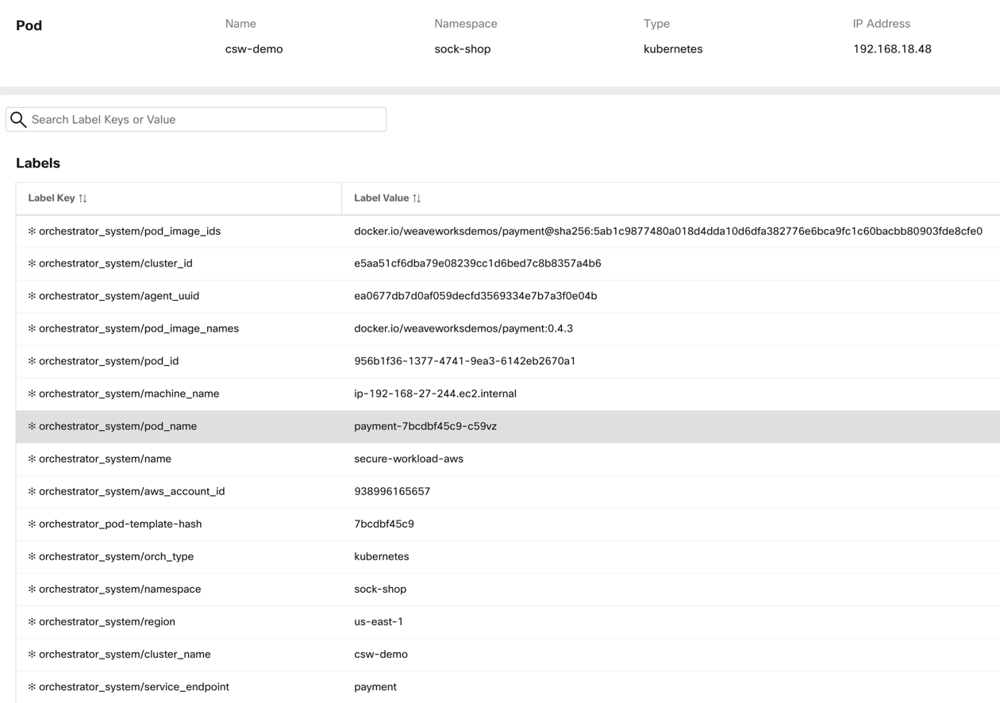
*Figure 3 — Pod profile with label metadata (© Cisco Systems, Inc.)*

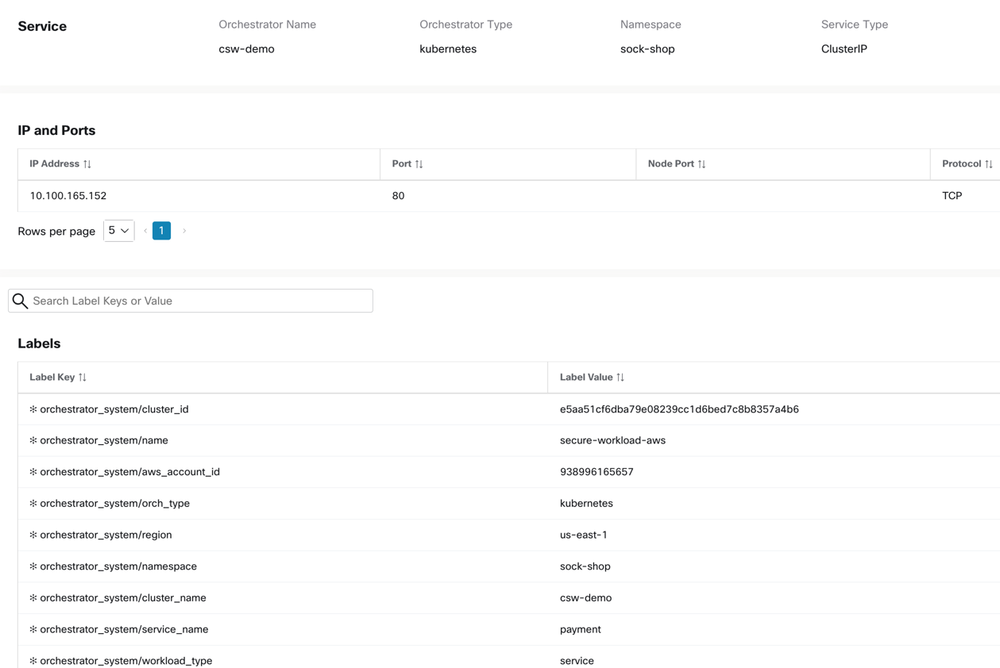
*Figure 4 — Service profile with label metadata (© Cisco Systems, Inc.)*

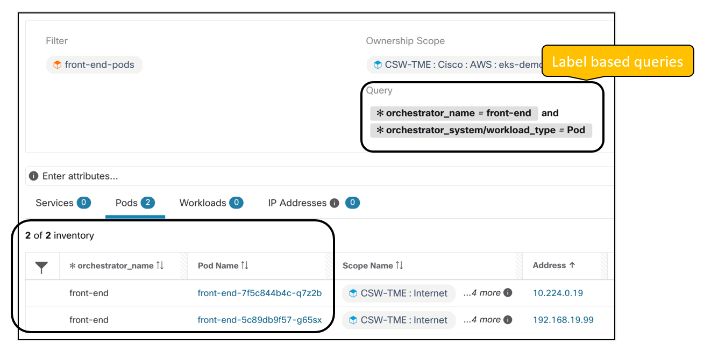
*Figure 5 — Inventory filter based on pod metadata (© Cisco Systems, Inc.)*

The cluster traffic patterns covered below:

1. **Pod → pod** (direct), intra-node and inter-node
2. **Pod → pod via ClusterIP Service** (DNAT), intra-node and inter-node
3. **External → pod** via NodePort / LoadBalancer
4. **Pod → external**

---

## 1. Direct pod-to-pod (no Service)

### Intra-node — both pods on the same node

```
   pod1 ──────────────► pod2          (same node)
   src=pod1IP   dst=pod2IP

   Captured at pod1 veth AND pod2 veth → DEDUPED → reported as 1 flow
```

A single flow `src=pod1IP, dst=pod2IP` is logged. Although it's seen at both
pod interfaces, the two observations are **deduped** into one.

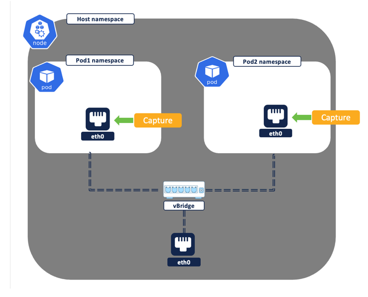
*Figure 7 — Intra node, pod-to-pod flow (© Cisco Systems, Inc.)*

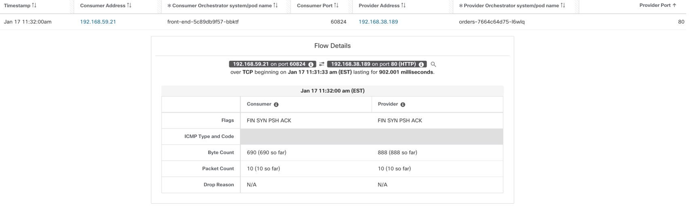
*Figure 8 — Intra node, captured pod-to-pod flow (© Cisco Systems, Inc.)*

### Inter-node — pods on different nodes

```
   pod1 (Node1) ─────────────────────────────► pod2 (Node2)

   Flow #1  src=pod1IP  dst=pod2IP        (captured at pod1 veth)
   Flow #2  depends on CNI mode:
            • Direct routing (routable pod CIDR):  no extra flow (deduped)
            • Overlay VXLAN/Geneve:  UDP tunnel flow  src=node1IP dst=node2IP
            • Overlay IPIP:          TCP flow         src=node1IP dst=node2IP
```

The first flow is the real `pod1→pod2`. Whether a **second** flow appears
depends entirely on the **CNI**:

| CNI mode | Second flow? | What it looks like |
|---|---|---|
| **Direct routing** (routable pod CIDR) | No — deduped to the single flow | n/a |
| **Overlay VXLAN / Geneve** | Yes | **UDP** tunnel flow `src=node1IP, dst=node2IP` (encapsulates the packet) |
| **Overlay IPIP** | Yes | **TCP** flow `src=node1IP, dst=node2IP` |

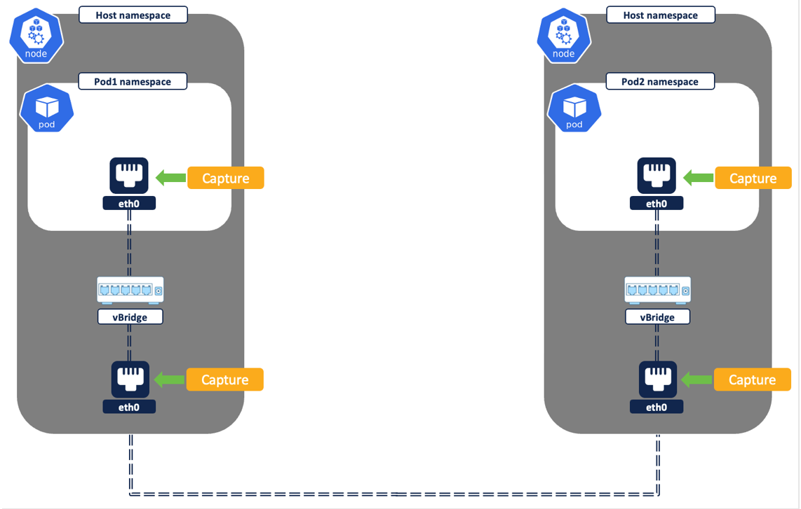
*Figure 9 — Inter node, pod-to-pod flow (© Cisco Systems, Inc.)*

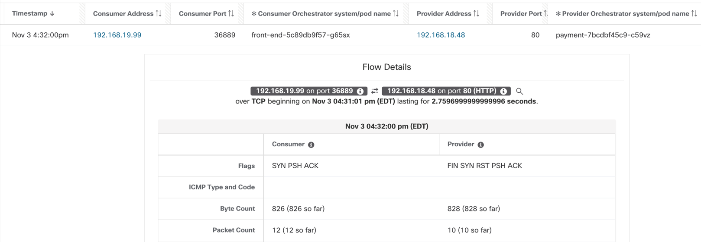
*Figure 10 — Inter node, captured pod-to-pod flow (© Cisco Systems, Inc.)*

> **Reading tip.** When you see a UDP `node→node` flow alongside a `pod→pod`
> flow, that's overlay encapsulation, not a separate connection. Don't write
> policy against the tunnel flow.

---

## 2. Pod-to-pod via a ClusterIP Service (DNAT)

A connection to a `ClusterIP` Service is **DNAT'd** to a backend pod in the host
namespace. That's why you see the **Service IP** on the first hop and the
**backend pod IP** on the second — marked **Related**.

### Intra-node

```
   pod1 ──► ClusterIP(svc) ──[DNAT in node netns]──► pod2     (same node)

   Flow #1  src=pod1IP  dst=serviceIP     (captured at pod1 veth)
   Flow #2  src=pod1IP  dst=pod2IP        (captured at pod2 veth, post-DNAT)
   → Flow #1 and #2 shown as RELATED
```

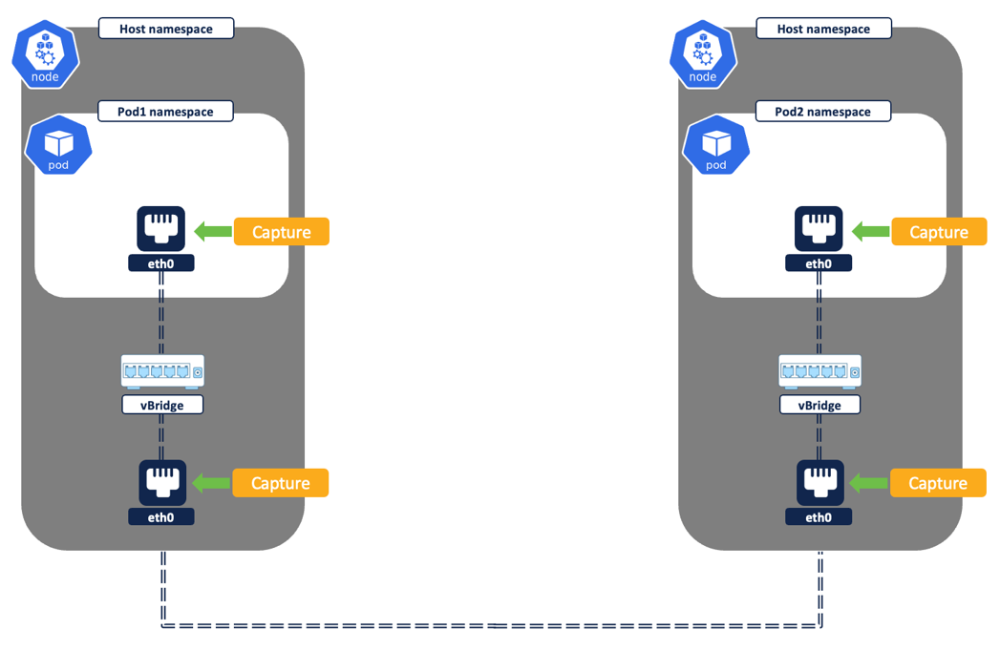
*Figure 11 — Pod-to-pod flows via service (© Cisco Systems, Inc.)*

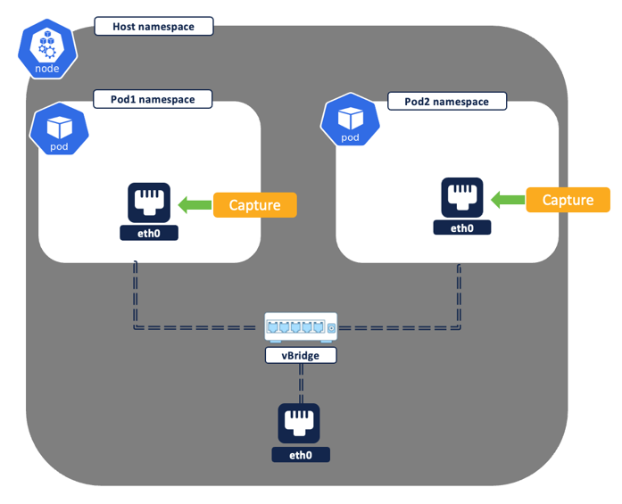
*Figure 12 — Intra node, pod-to-pod via service (© Cisco Systems, Inc.)*

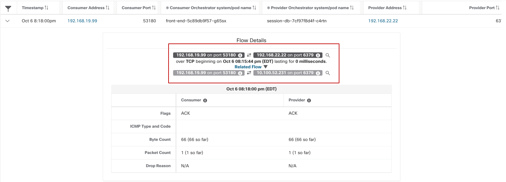
*Figure 13 — Pod-to-pod via service, intra node (© Cisco Systems, Inc.)*

### Inter-node

```
   pod1 (Node1) ──► ClusterIP(svc) ──[DNAT]──► pod2 (Node2)

   Flow #1  src=pod1IP  dst=serviceIP   (at pod1 veth)
   Flow #2  src=pod1IP  dst=pod2IP      (at node1 interface, post-DNAT) — RELATED
   Flow #3  CNI-dependent (same table as §1 inter-node):
            direct routing → none;  VXLAN/Geneve → UDP node→node;  IPIP → TCP node→node
```

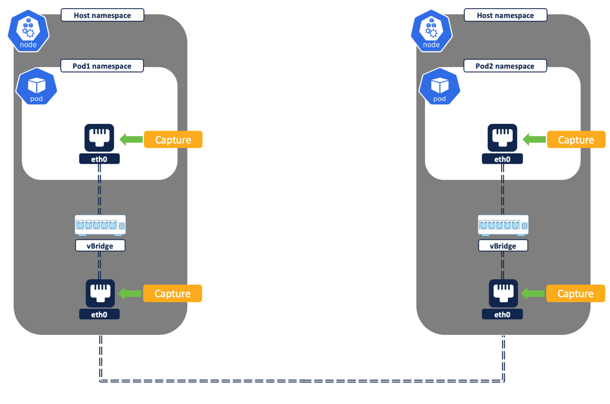
*Figure 14 — Pod-to-pod, inter node (© Cisco Systems, Inc.)*

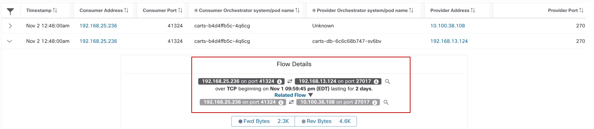
*Figure 15 — Pod-to-pod via service, inter node (© Cisco Systems, Inc.)*

| Hop | Flow | Where captured |
|---|---|---|
| 1 | `src=pod1IP, dst=serviceIP` | source pod veth |
| 2 | `src=pod1IP, dst=pod2IP` (post-DNAT) | node1 interface — **Related** to #1 |
| 3 | overlay tunnel `node1→node2` (UDP VXLAN/Geneve, or TCP IPIP), or none if direct routing | node interface |

---

## 3. External IP → pod (NodePort / LoadBalancer)

NodePort and LoadBalancer Services are essentially the same to the data path;
LoadBalancer just adds a cloud LB in front that distributes to node IPs. Either
way you get **two** flow sets (plus an optional third if the chosen pod is on a
different node).

```
   External client ──► Node IP:NodePort ──[SNAT to nodeIP + DNAT to podIP:podPort]──► pod

   Flow #1  src=ExternalIP  dst=NodeIP:NodePort     (captured at node interface)
   Flow #2  src=NodeIP      dst=PodIP:PodPort       (captured at pod interface, post-NAT)
   Flow #3  (optional) if the pod lands on another node → CNI-dependent flow
```

1. `src=ExternalIP, dst=NodeIP:NodePort` — logged at the **node** interface.
2. Traffic undergoes **SNAT** (source → node IP) **and DNAT** (service →
   `podIP:podPort`).
3. `src=NodeIP, dst=PodIP:PodPort` — logged at the **pod** interface.
4. A third flow may appear if the destination pod is on a different node (CNI
   dependent).

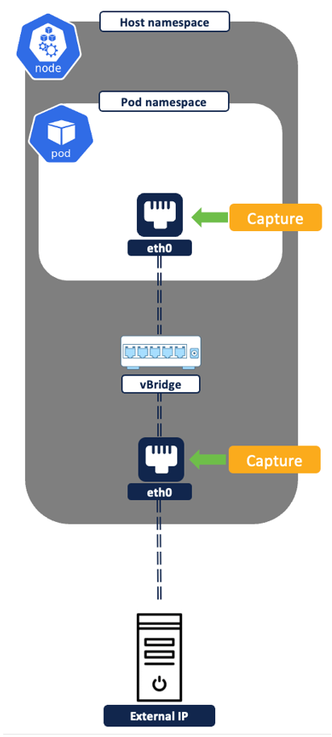
*Figure 16 — External IP to pod IP flows (© Cisco Systems, Inc.)*

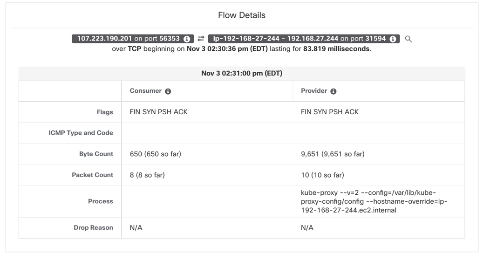
*Figure 17 — External IP to Node IP:NodePort (© Cisco Systems, Inc.)*

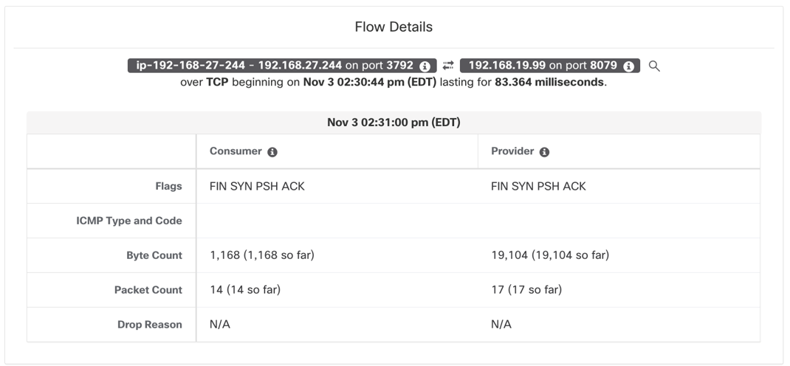
*Figure 18 — Node IP to Pod IP:PodPort (© Cisco Systems, Inc.)*

*(For clarity the source above assumes the pod is on the same node the
connection lands on.)*

---

## 4. Pod → external IP

```
   pod ──► External IP ──[SNAT to nodeIP in host netns]──► Internet

   Flow #1  src=PodIP   dst=ExternalIP     (captured at pod veth)
   Flow #2  src=NodeIP  dst=ExternalIP     (captured at node interface, post-SNAT)
```

Two flows: the real `pod→external` at the pod interface, and the **SNAT'd**
`node→external` at the node interface.

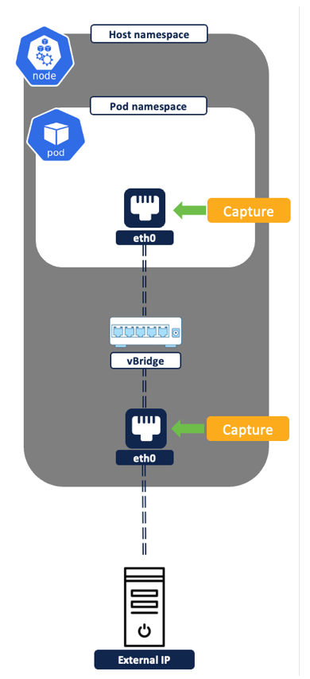
*Figure 19 — Pod to external IP flows (© Cisco Systems, Inc.)*

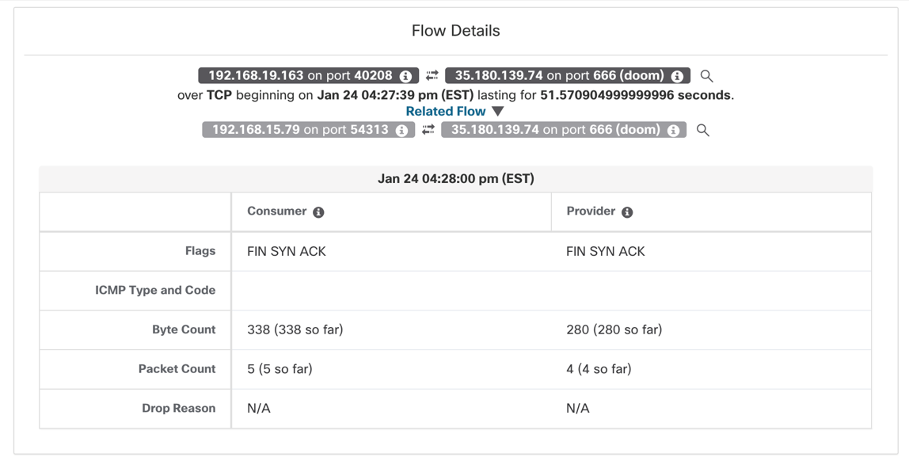
*Figure 20 — Pod to external IP communications (© Cisco Systems, Inc.)*

---

## Quick reference — how many flows?

| Pattern | Intra-node | Inter-node (direct routing) | Inter-node (overlay) |
|---|---|---|---|
| Direct pod→pod | 1 (deduped) | 1 (deduped) | 2 (+1 UDP/TCP tunnel) |
| Pod→pod via ClusterIP | 2 (Related) | 2 (Related) | 3 (+1 tunnel) |
| External→pod (NodePort/LB) | 2 | 2 | 3 |
| Pod→external | 2 | 2 | 2 |

> **Why this matters for policy.** ADM and live analysis present these as the
> logical conversations; you author policy against **pod/service labels**, not
> the NAT'd or tunneled artifacts. Knowing the mechanics lets you sanity-check
> the flow map and explain "extra" flows to app owners.

---

## See also

- [`docs/03-enforcement-translation.md`](./03-enforcement-translation.md) — how
  these flows become allow/deny rules at the node and pod
- [`docs/01-architecture.md`](./01-architecture.md) — why capture happens at both
  pod and node interfaces
- [`operations/02-troubleshooting.md`](../operations/02-troubleshooting.md) —
  when expected flows don't show up
