# Enforcement — how a policy intent becomes node & pod rules

> **Cisco source.** [Secure Workload and Kubernetes Security — Deep Dive](https://secure.cisco.com/secure-workload/docs/secure-workload-and-k8s),
> Use Case #2 (Figures 21–44).

When you enforce a policy on a cluster, the Secure Workload **policy engine
translates the intent into two kinds of concrete iptables rules**:

- **Container rules** — programmed into the **specific pod's namespace iptables**.
- **Concrete (node) rules** — programmed into the **node namespace iptables**.

A crucial recurring theme: for most **pod-to-pod** traffic, **no node-level
filtering rule is created** — the CNI handles routing, and inter-node pod
traffic rides the default allow-all `FORWARD` chain. Node rules appear mainly for
**NodePort/LoadBalancer ingress** and **node-sourced health checks**.

```
   Policy intent (label-based: consumer → provider : service)
                          │
                 ┌────────┴─────────┐
                 ▼                  ▼
        CONTAINER rules        CONCRETE (node) rules
        pod netns iptables     node netns iptables
        (EGRESS on consumer,   (NodePort pre-routing,
         INGRESS on provider)   node→pod healthchecks)
```

The five canonical patterns below mirror the five flow patterns from
[`docs/02-flow-visibility.md`](./02-flow-visibility.md).

---

## Pattern 1 — Direct pod → pod (no Service)

**Intent:** *Allow `payment` pod → `user-db` pod on tcp/27017.* *(Figures 24–28.)*

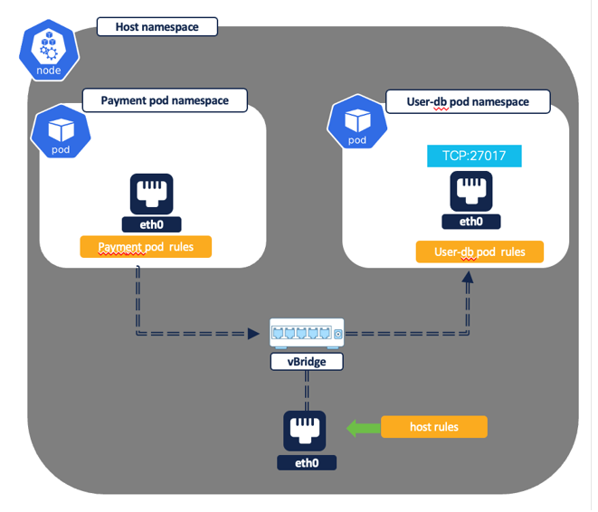
*Figure 24 — Pod-to-pod flow, intra node (© Cisco Systems, Inc.)*

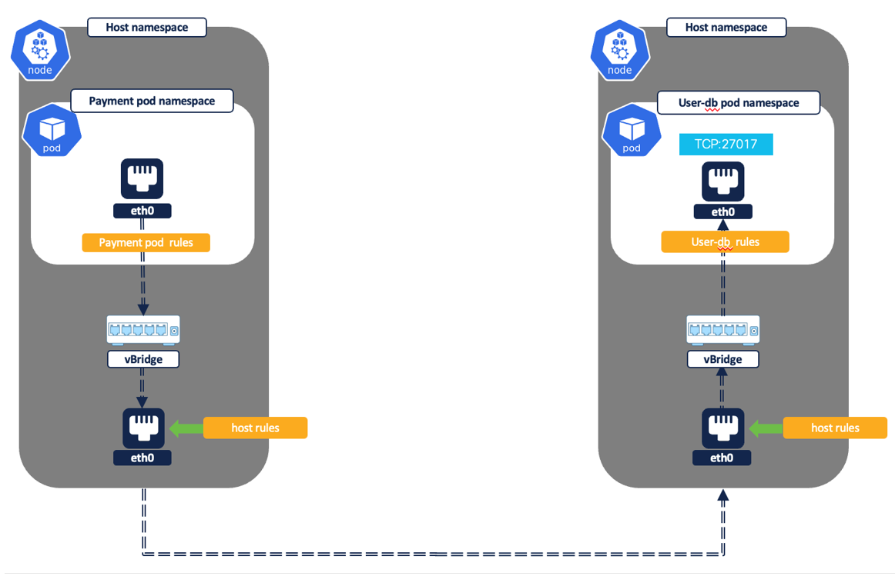
*Figure 25 — Pod-to-pod flow, inter node (© Cisco Systems, Inc.)*

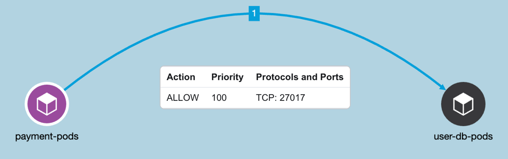
*Figure 26 — Example policy: allow payment → user-db on tcp/27017 (© Cisco Systems, Inc.)*

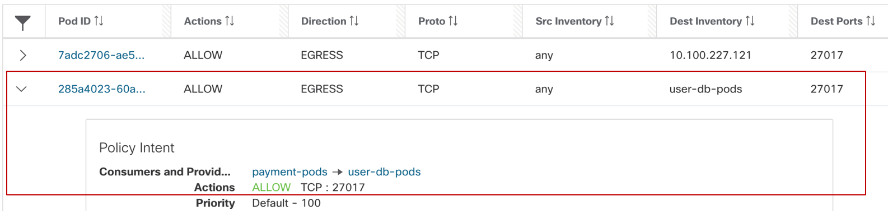
*Figure 27 — Payment pod rule, EGRESS (© Cisco Systems, Inc.)*

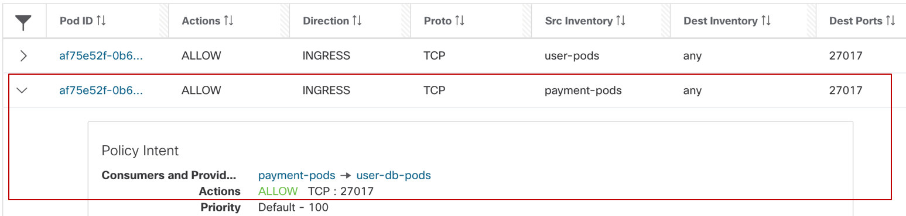
*Figure 28 — Userdb pod rule, INGRESS (© Cisco Systems, Inc.)*

```
   payment pod                         user-db pod
   ┌───────────────────┐               ┌───────────────────┐
   │ EGRESS rule:      │  tcp/27017    │ INGRESS rule:     │
   │ allow → user-db   │ ────────────► │ allow ← payment   │
   │ on tcp/27017      │               │ on tcp/27017      │
   └───────────────────┘               └───────────────────┘
   (container rule)                    (container rule)

   Node level: NO filtering rule — CNI routes; FORWARD chain allow-all
```

| Rule type | Pod | Direction | Rule |
|---|---|---|---|
| Container | payment | EGRESS | allow payment → user-db on tcp/27017 |
| Container | user-db | INGRESS | allow payment → user-db on tcp/27017 |
| Concrete (node) | — | — | **none** (CNI handles routing; inter-node via allow-all FORWARD) |

> **Note (source/dest "Any").** In the payment EGRESS rule the source IP is
> "Any" — meaning *any interface belonging to the payment pod* (identified by Pod
> ID). Likewise the user-db INGRESS destination is "Any" (any user-db interface).
> You *can* pin to a specific interface IP if a pod is multi-homed.

---

## Pattern 2 — Pod → pod via ClusterIP Service

**Intent:** *Allow `frontend` pod → `carts` Service on tcp/80* (service IP e.g.
`10.100.135.136`, carts pod also listens on tcp/80). *(Figures 29–32.)*

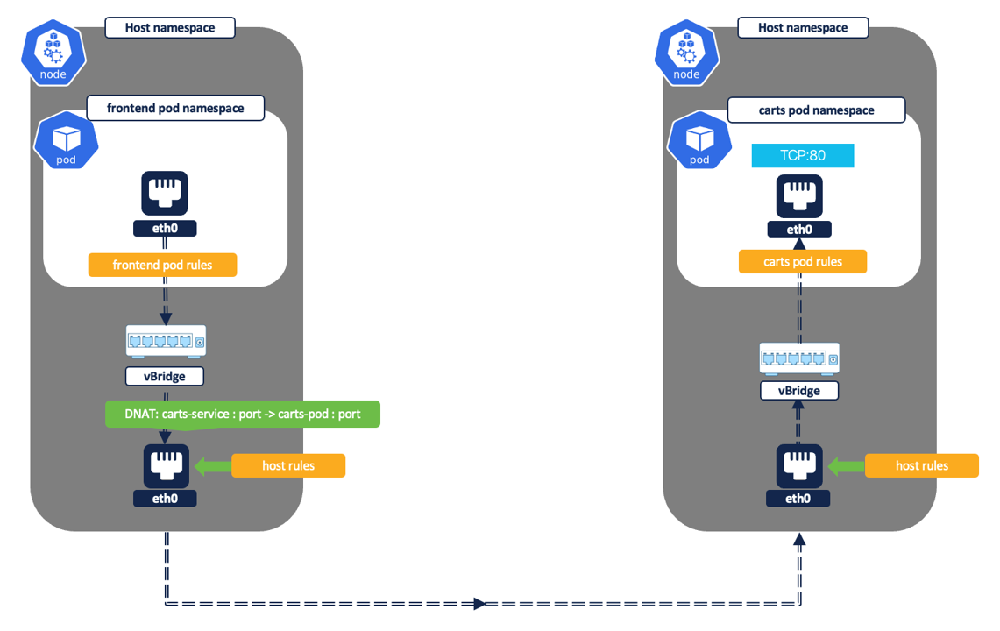
*Figure 29 — Pod-to-pod via ClusterIP service (© Cisco Systems, Inc.)*

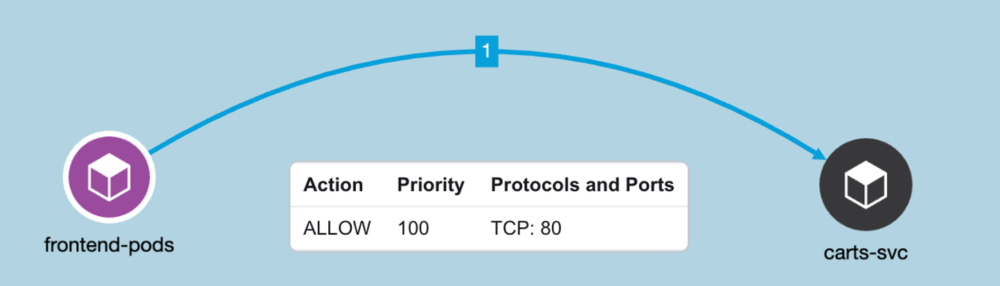
*Figure 30 — Example policy: allow frontend → carts service on tcp/80 (© Cisco Systems, Inc.)*

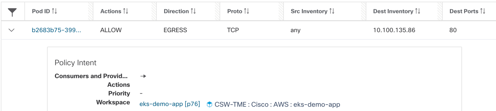
*Figure 31 — Frontend pod rules, EGRESS to service IP (© Cisco Systems, Inc.)*

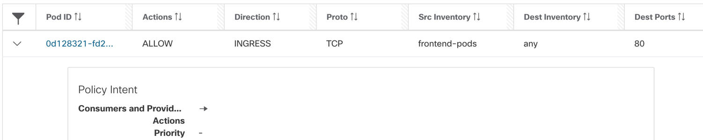
*Figure 32 — Carts pod rules, INGRESS (dst auto = carts pod IP) (© Cisco Systems, Inc.)*

```
   frontend pod                            carts pod
   ┌────────────────────────┐              ┌────────────────────────┐
   │ EGRESS:                │   tcp/80     │ INGRESS:               │
   │ allow → carts SERVICE  │ ───[DNAT]──► │ allow ← frontend       │
   │ IP on tcp/80           │              │ (dst auto = carts podIP)│
   └────────────────────────┘              └────────────────────────┘
   (container rule)                        (container rule, auto-generated)

   Node level: NO filtering rule (CNI routes; FORWARD allow-all)
```

| Rule type | Pod | Direction | Rule |
|---|---|---|---|
| Container | frontend | EGRESS | allow frontend → **carts ClusterIP** on tcp/80 |
| Container | carts | INGRESS | allow frontend → carts pod on tcp/80 |
| Concrete (node) | — | — | **none** |

> **The auto-generated bit.** The intent names the **Service IP** as the
> destination, but ingress traffic arrives at the carts pod already **DNAT'd to
> the carts pod IP**. So the policy engine **auto-generates** an INGRESS rule
> allowing the destination = carts pod IP, even though the pod IP was never in
> the original intent. This is the engine reconciling intent with the data path.

---

## Pattern 3 — Node-sourced health checks → pod

**Intent:** *Allow Kubernetes health/readiness probes to `frontend` pod on
tcp/80.* Probes originate from **node IPs**, so this needs a **node (concrete)**
rule. *(Figures 33–36.)*

```
   Cluster node                          frontend / payment pod
   ┌───────────────────┐                 ┌───────────────────┐
   │ EGRESS (concrete):│   tcp/80        │ INGRESS:          │
   │ allow nodeIP →    │ ──────────────► │ allow nodeIPs →   │
   │ pod on tcp/80     │                 │ any on tcp/80     │
   └───────────────────┘                 └───────────────────┘
   (node rule)                           (container rule)
```

| Rule type | Where | Direction | Rule |
|---|---|---|---|
| Concrete (node) | cluster nodes | EGRESS | allow node IP → pod on tcp/80 |
| Container | pod | INGRESS | allow node IPs → any on tcp/80 |

> Source "Any" on the node rule = any interface belonging to that cluster node.

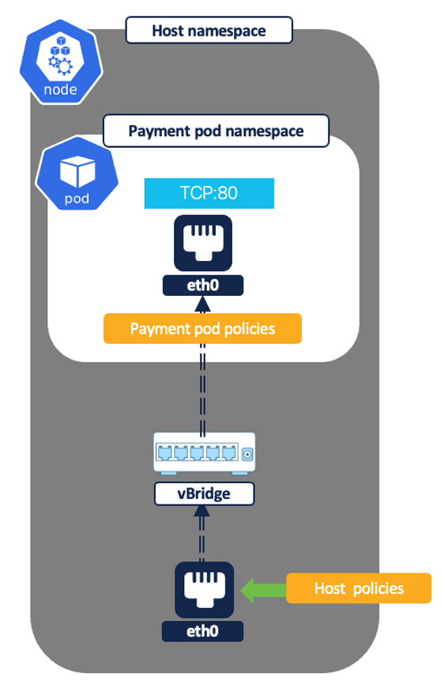
*Figure 33 — Node to pod, health checks (© Cisco Systems, Inc.)*

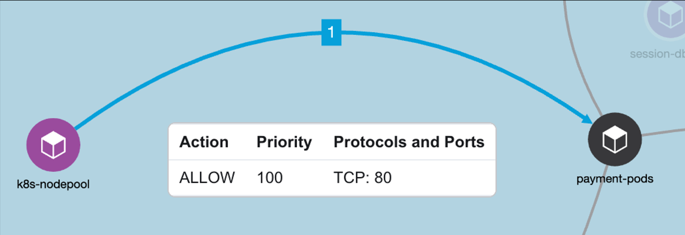
*Figure 34 — Example policy: allow health/readiness probes to frontend on tcp/80 (© Cisco Systems, Inc.)*

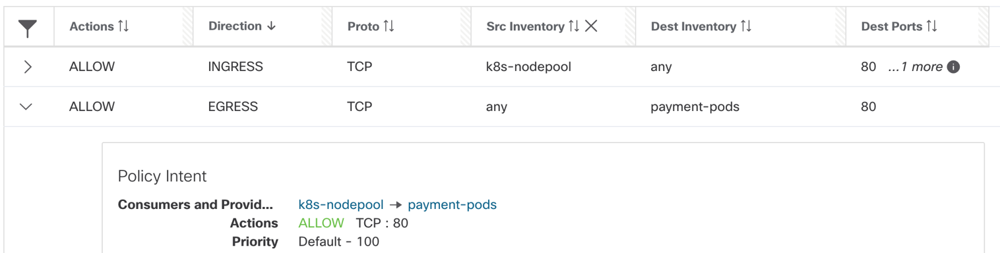
*Figure 35 — Cluster node rules, EGRESS node IP → pod (© Cisco Systems, Inc.)*

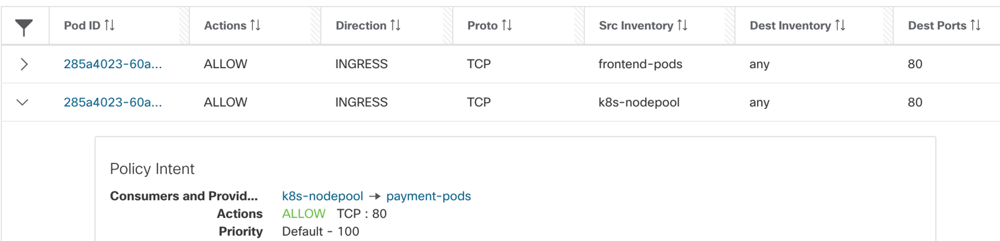
*Figure 36 — Pod rules, INGRESS node IPs → pod (© Cisco Systems, Inc.)*

---

## Pattern 4 — External → pod via NodePort / LoadBalancer

**Intent:** *Allow any internet user → `frontend` NodePort Service on tcp/80*
(frontend pod listens on `8079`, NodePort is `31095`). *(Figures 37–40.)*

```
   Internet ──► Node:31095 ──[pre-routing DNAT]──► frontend pod:8079

   NODE (concrete) rules:
     INGRESS: allow any → node pool IPs on tcp/31095 (NodePort)
     + auto-generated pre-routing allow for the NodePort
   POD (container) rules:
     INGRESS: allow any → frontend pod IP on tcp/8079
     + auto-generated allow for the pod port
```

| Rule type | Where | Direction | Rule |
|---|---|---|---|
| Concrete (node) | cluster nodes | INGRESS | allow any → node pool IPs on tcp/**31095** (+ auto pre-routing allow) |
| Container | frontend | INGRESS | allow any → frontend pod IP on tcp/**8079** (+ auto pod-port allow) |

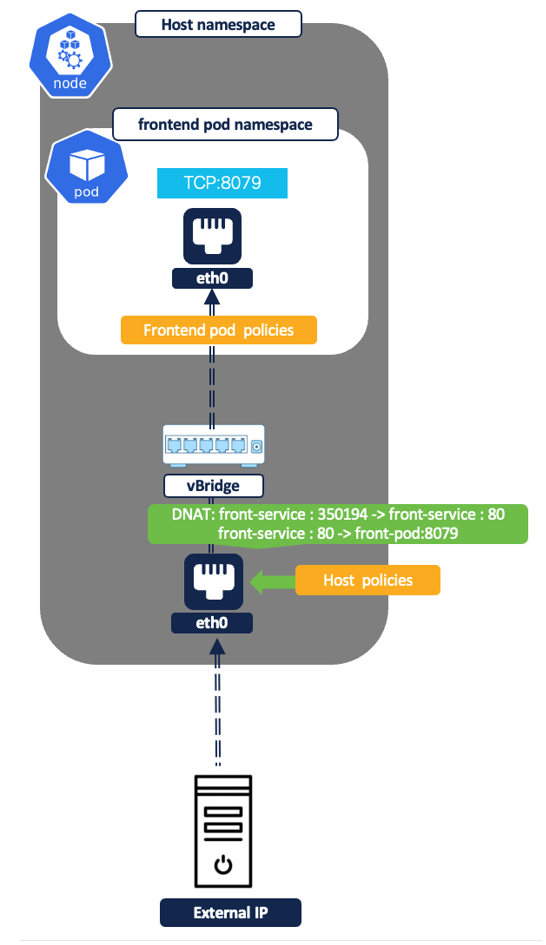
*Figure 37 — External IP to pod (© Cisco Systems, Inc.)*

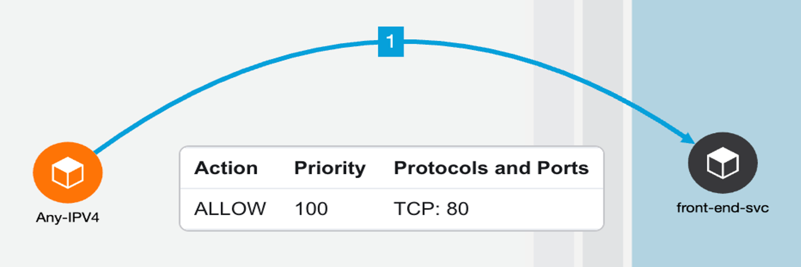
*Figure 38 — Example policy: allow any internet user → frontend NodePort service (© Cisco Systems, Inc.)*

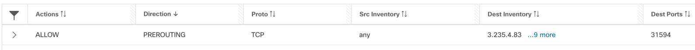
*Figure 39 — Policy engine pre-routing allow rule for NodePort (© Cisco Systems, Inc.)*

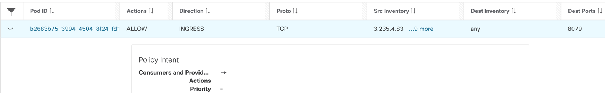
*Figure 40 — Frontend pod, allow any IP on tcp/8079 (© Cisco Systems, Inc.)*

> **Split-scope gotcha.** If nodes and app pods/services are mapped to
> **different parent/child scopes**, you must add the allow rule to the frontend
> service on **both** scopes — otherwise one half blocks the flow. (See
> [`docs/04-scope-design.md`](./04-scope-design.md).)

---

## Pattern 5 — Pod → external IP

**Intent:** *Allow `frontend`/`payment` pod IPs → an external IP on tcp/666.*
*(Figures 41–43.)*

```
   payment pod ──► external IP:666 ──[SNAT to nodeIP in node netns]──► Internet

   POD (container) rule:
     EGRESS: allow payment pod → external IP on tcp/666
   NODE (concrete) rule:
     none — traffic is SNAT'd to node IP and allowed by default allow-all FORWARD
```

| Rule type | Where | Direction | Rule |
|---|---|---|---|
| Container | payment | EGRESS | allow payment pod → external IP on tcp/666 |
| Concrete (node) | — | — | **none** (SNAT to node IP, default FORWARD allow-all) |

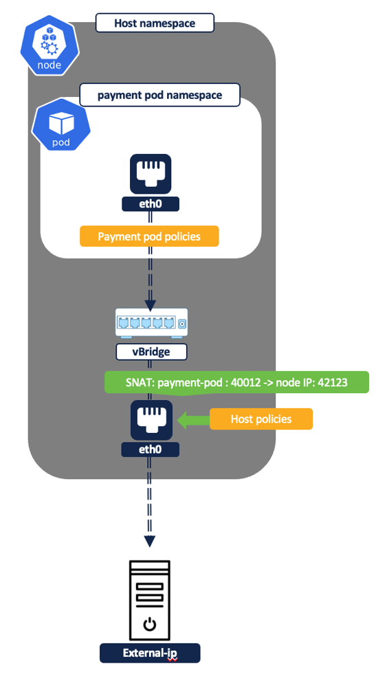
*Figure 41 — Pod to external IP (© Cisco Systems, Inc.)*

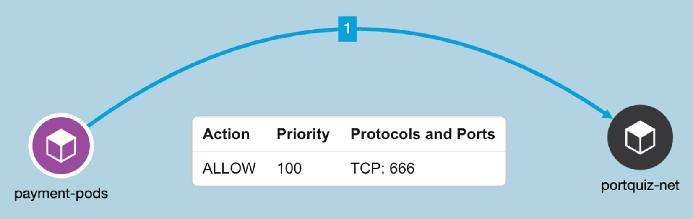
*Figure 42 — Example policy: allow frontend pod IPs → external IP on tcp/666 (© Cisco Systems, Inc.)*

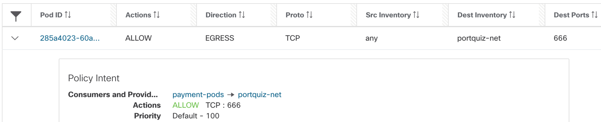
*Figure 43 — Payment pod rule, EGRESS to external IP on tcp/666 (© Cisco Systems, Inc.)*

---

## Mental model — where do rules land?

| Traffic pattern | Container (pod) rules | Concrete (node) rules |
|---|---|---|
| Direct pod→pod | ✅ EGRESS + INGRESS | ❌ none |
| Pod→pod via ClusterIP | ✅ EGRESS + INGRESS (auto dst=podIP) | ❌ none |
| Node→pod health checks | ✅ INGRESS | ✅ EGRESS |
| External→pod (NodePort/LB) | ✅ INGRESS (+auto pod-port) | ✅ INGRESS (+auto pre-routing) |
| Pod→external | ✅ EGRESS | ❌ none |

**Rule of thumb:** pod-to-pod is enforced **in the pods**; anything involving a
**node IP** (NodePort ingress, health checks) also needs **node** rules. The
engine auto-generates the data-path reconciliation rules (post-DNAT pod IPs,
pre-routing NodePort allows) so your **intent stays label-based**.

> **CNI rules are preserved.** Secure Workload's filter rules take priority while
> the CNI's own iptables rules are kept intact — **requires *Preserve Rules*** in
> the agent config for K8s/OpenShift. See
> [`operations/01-cni-coexistence.md`](../operations/01-cni-coexistence.md).

---

## Validate before, monitor after

Enforcement sits between two analysis steps in the lifecycle. **Before**
enforcing, live policy analysis lets you compare a policy version against real
cluster traffic **without** enforcing it — so you catch unexpected allows/blocks
first (Figure 23). **After** enforcing, live analysis continues as **compliance
monitoring** to flag drift or unexpected outcomes (Figure 44).

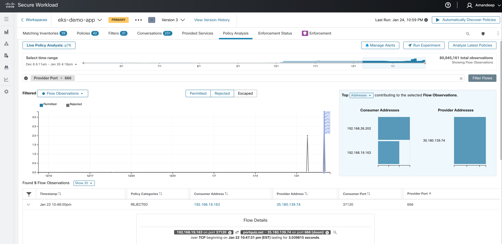
*Figure 23 — Policy analysis against live traffic, pre-enforcement (© Cisco Systems, Inc.)*

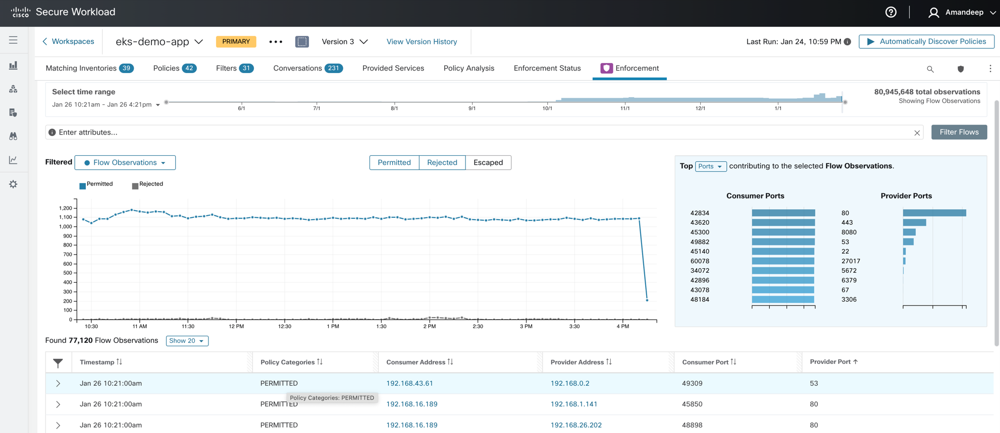
*Figure 44 — Policy compliance monitoring, post-enforcement (© Cisco Systems, Inc.)*

---

## See also

- [`docs/02-flow-visibility.md`](./02-flow-visibility.md) — the flow patterns
  these rules correspond to
- [`docs/04-scope-design.md`](./04-scope-design.md) — single vs split scope and
  the dual-scope allow-rule gotcha
- [`operations/01-cni-coexistence.md`](../operations/01-cni-coexistence.md) —
  *Preserve Rules* and Calico/Felix config
- Cisco: [Manage Policy Lifecycle](https://www.cisco.com/c/en/us/td/docs/security/workload_security/secure_workload/user-guide/4_0/cisco-secure-workload-user-guide-on-prem-v40/manage-policy-lifecycle-in-secure-workload.html)
