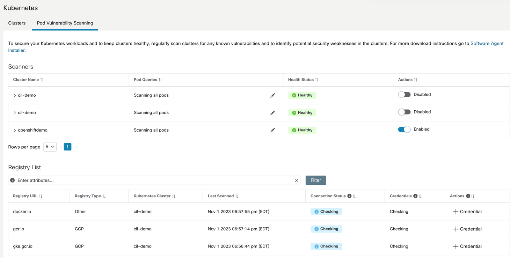
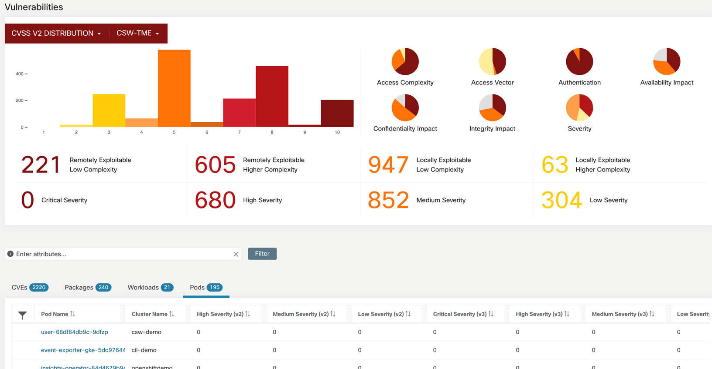

# Container image vulnerability scanning

> **Cisco source.** [Secure Workload and Kubernetes Security — Deep Dive](https://secure.cisco.com/secure-workload/docs/secure-workload-and-k8s),
> Use Case #3 (Figures 45–46).

Beyond flow visibility and segmentation, Secure Workload can give you visibility
into the **software packages and CVEs** in the container images running on a
Kubernetes/OpenShift cluster — and let you build **CVE-risk-based segmentation
policies** from that data.

---

## How it works

```mermaid
flowchart LR
  EN["Enable scanning on the onboarded cluster\n(via the connector/orchestrator)"]
  POD["Scanner pod spins up on the cluster"]
  IMG["Scanner lists container images running on the cluster"]
  REG["Auto-populates the registries hosting those images\n(in CSW console)"]
  CRED["Admin adds registry credentials if pulls require auth"]
  SCAN["Scanner pulls images & scans for CVEs"]
  REP["CVE report published in CSW UI"]
  POLICY["Pod CVE attributes → policy objects → CVE-risk segmentation"]

  EN --> POD --> IMG --> REG --> CRED --> SCAN --> REP --> POLICY
```




*Figure 45 — Enable container scanning (© Cisco Systems, Inc.)*

1. For any cluster **onboarded via a connector/orchestrator**, you can optionally
   **enable vulnerability scanning**. *(Figure 45.)*
2. A **scanner pod** is spun up on the cluster.
3. The scanner **lists the container images** running on the cluster and
   **auto-populates the registries** where those images are hosted in the CSW
   console.
4. If pulling an image needs credentials, the admin is **prompted to add registry
   credentials**.
5. With credentials in place, the scanner **pulls each image and scans for
   CVEs**; the **CVE report is published** in the Secure Workload UI. *(Figure 46.)*

   
   *Figure 46 — Vulnerability dashboard (© Cisco Systems, Inc.)*
6. **Pod CVE attributes become policy objects** — so you can define CVE-risk-based
   segmentation (e.g. quarantine pods running images with a critical CVE).

---

## Requirements & limits

| Item | Detail |
|---|---|
| **Agent/DaemonSet required** | Yes — *"Daemonset or agent installation is required for this functionality to be available."* |
| **Image OS support** | **Linux containers only** for CVE scanning (at time of the whitepaper) |
| **Registry access** | Scanner must be able to reach the registry; add credentials for private registries |
| **Onboarding** | Cluster must be onboarded via a connector/orchestrator before enabling |

> **Confirm against your release.** Windows container scanning and registry
> support evolve — check the
> [Compatibility Matrix / User Guide](./00-official-references.md) for your CSW
> version.

---

## Putting it to work — CVE-risk segmentation

Because CVE attributes attach to pods, you can author inventory filters like:

```
   package CVE severity = Critical  AND  namespace = payments
```

…and use that as a **consumer/provider** in a policy — e.g. deny egress from any
pod running a critically-vulnerable image until it's patched. This ties the
vulnerability picture directly to the segmentation model rather than living in a
separate scanning silo.

---

## See also

- [`docs/01-architecture.md`](./01-architecture.md) — the scanner as component #4
- [`docs/03-enforcement-translation.md`](./03-enforcement-translation.md) — how
  CVE-based intent compiles into pod/node rules
- [`install/02-connector-orchestrator.md`](../install/02-connector-orchestrator.md)
  — onboarding the cluster (prerequisite for scanning)
